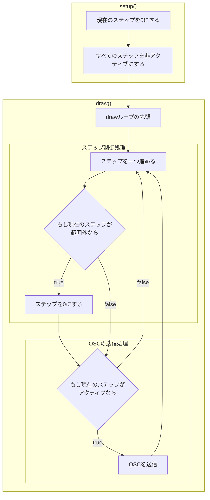

# 制作時のレシピ

- [Sequencer8x1](Sequencer8x1): 8ステップ1パートのシーケンサ
- [Sequencer4x2](Sequencer4x2): 4ステップ2パートのシーケンサ
- [Jaikenzan](Jaikenzan): じゃいけんざん
- [EuclidRhythmSender](EuclidRhythmSender): ユークリッドのリズム

## シーケンサーのフローチャート

