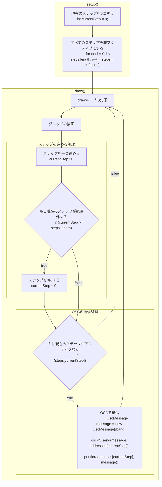

# 制作時のレシピ

- [Sequencer1x8](Sequencer1x8): 1トラック8ステップのシーケンサー
- [Sequencer2x4](Sequencer2x4): 2トラック4ステップのシーケンサー
- [Jaikenzan](Jaikenzan): じゃいけんざん
- [EuclidRhythmSender](EuclidRhythmSender): ユークリッドのリズム

## シーケンサーのフローチャート

