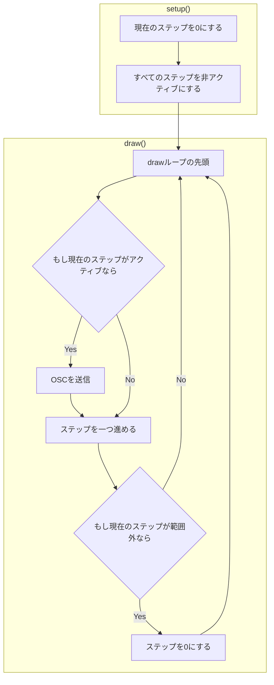

# 制作時のレシピ

## シーケンサーのフローチャート

```mermaid
flowchart
    subgraph "setup()"
    initCs[現在のステップを0にする]
    initStep[すべてのステップを非アクティブにする]
    end
    subgraph "draw()"
    loopStart[drawループの先頭]
    ifStepTrue{もし現在のステップがアクティブなら}
    sendOsc[OSCを送信]
    incBi[ステップを一つ進める]
    ifCsOver{もし現在のステップが範囲外なら}
    resetCs[ステップを0にする]
    end

    initCs --> initStep
    initStep --> loopStart

    loopStart --> ifStepTrue
    ifStepTrue --> |Yes| sendOsc
    sendOsc --> incBi
    ifStepTrue --> |No| incBi
    incBi --> ifCsOver
    ifCsOver -->|Yes| resetCs
    resetCs --> loopStart
    ifCsOver -->|No| loopStart
```
