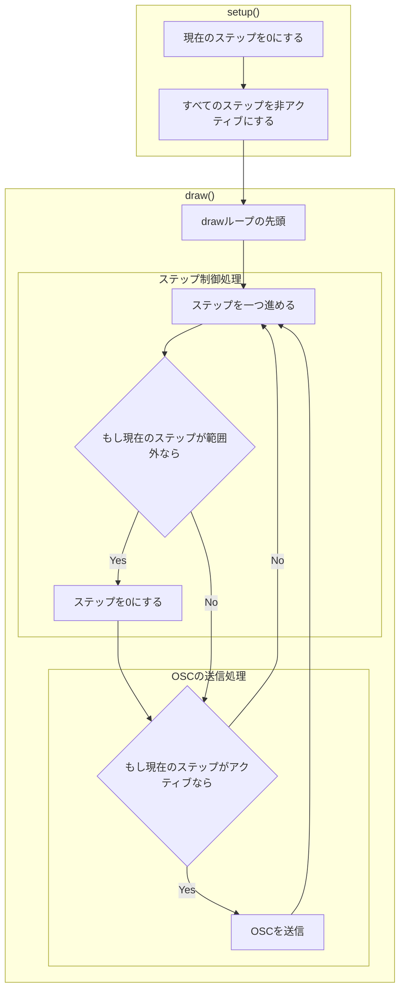

# 制作時のレシピ

## シーケンサーのフローチャート

```mermaid
flowchart
    subgraph "setup()"
        initCs[現在のステップを0にする]
        initStep[すべてのステップを非アクティブにする]
    end
    subgraph "draw()"
        loopStart[drawループの先頭]
        subgraph ステップ制御処理
            incStep[ステップを一つ進める]
            ifCsOver{もし現在のステップが範囲外なら}
            resetCs[ステップを0にする]
        end
        subgraph OSCの送信処理
            ifStepTrue{もし現在のステップがアクティブなら}
            sendOsc[OSCを送信]
        end
    end

    initCs --> initStep
    initStep --> loopStart

    loopStart --> incStep
    incStep --> ifCsOver
    ifCsOver -->|Yes| resetCs --> ifStepTrue
    ifCsOver -->|No| ifStepTrue
    ifStepTrue --> |Yes| sendOsc --> incStep
    ifStepTrue --> |No| incStep
```
